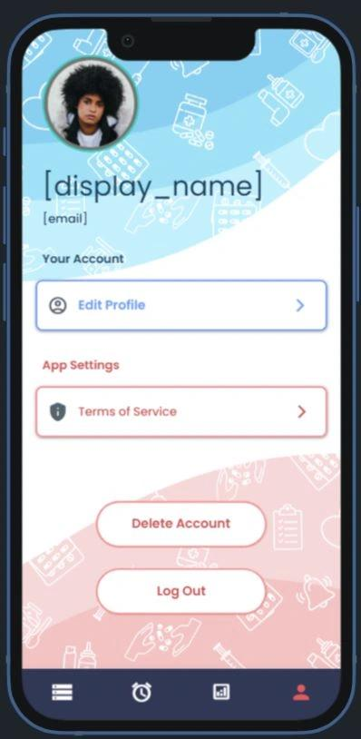
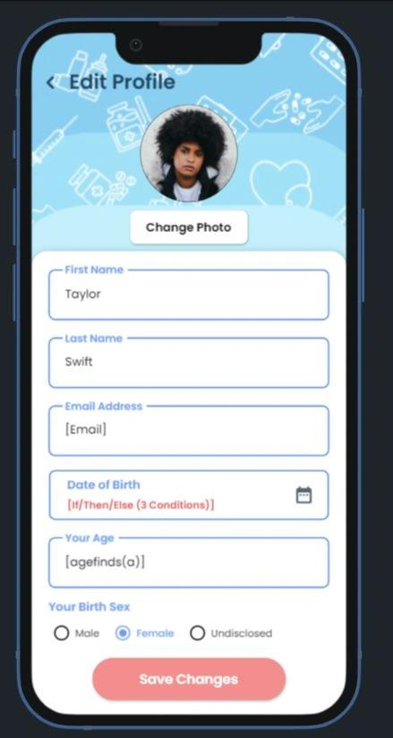
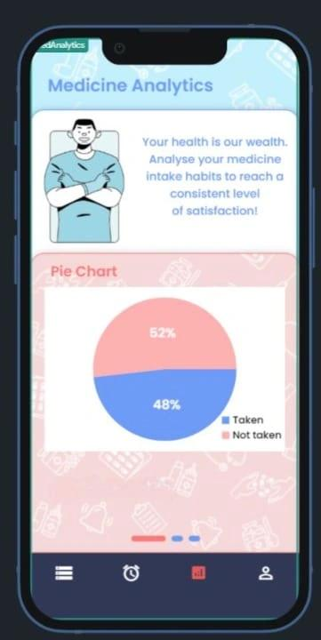

# Remedi — Smart Medication Management Application

**Remedi** is a mobile application designed to empower users with a convenient and reliable platform for managing their medication schedules.  
Built by **Muhammad Farhan**, **Vaishak Ravindranath**, and **Arwa Vora**, this project leverages the capabilities of **FlutterFlow** to deliver a seamless, intuitive, and modern healthcare experience.

---

## Overview

Medication management is an essential yet often overlooked aspect of healthcare. **Remedi** simplifies this process by enabling users to schedule, track, and monitor their medications through an easy-to-use interface.  
The application focuses on accessibility, reliability, and helping users maintain consistency in their medication routines.

---

## Problem & Solution

Many individuals, especially those managing multiple prescriptions, struggle to maintain consistent medication routines. Missed doses or incorrect timing can lead to serious health complications.

**Remedi** addresses this issue by providing a structured and intuitive system that automates reminders, organizes medication data, and promotes adherence through transparent tracking.  
The goal is to reduce user effort while improving health outcomes through timely medication intake and better organization.

---

## Design & User Experience

Remedi was built with a focus on **accessibility and simplicity**, ensuring that users of all age groups can navigate the app with ease.  
Key design considerations included:
- Clear typography and high-contrast color palette for readability  
- Minimal steps for adding or editing medications  
- Logical flow between screens for seamless task completion  
- Material Design principles for visual consistency across platforms  

The app’s interface was prototyped and refined in **FlutterFlow**, allowing rapid iteration and testing of design ideas without manual coding.

---

## Key Features

### Streamlined Medication Management
Users can add and organize all relevant medication details, including **names, dosages, frequencies, and intake instructions**, ensuring all critical information is available at a glance.

### Customizable Reminders
Remedi allows users to set up **personalized reminders** with flexible scheduling options to help ensure medications are taken on time and at the correct dosage.

### Medication Tracking
Users can optionally track their medication history, gaining insights into **adherence patterns** and **overall intake consistency**, which can be useful for healthcare discussions.

---

## App Screens

### Launch & Onboarding

  
  

### Authentication Flow

  
  
  

### Main Application

  
  
  

### Profile & Analytics

  
  
  

---

## Future Enhancements

Planned updates for Remedi include:
- Integration of **medication interaction checks**
- **Refill reminders** for timely prescription management
- **Educational resources** to promote medication adherence and health awareness

---

## Technology Stack

| Category | Technology |
|-----------|-------------|
| Platform | FlutterFlow (No-Code Application Builder) |
| Database | Firebase Cloud Firestore |
| Authentication | Firebase Authentication |

---

## System Architecture

> *(Simplified representation of data flow between app components.)*

